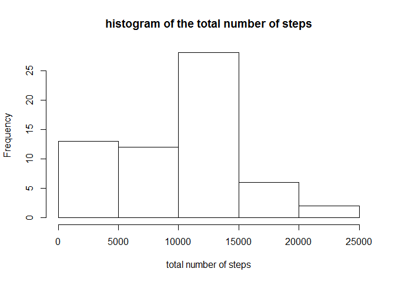
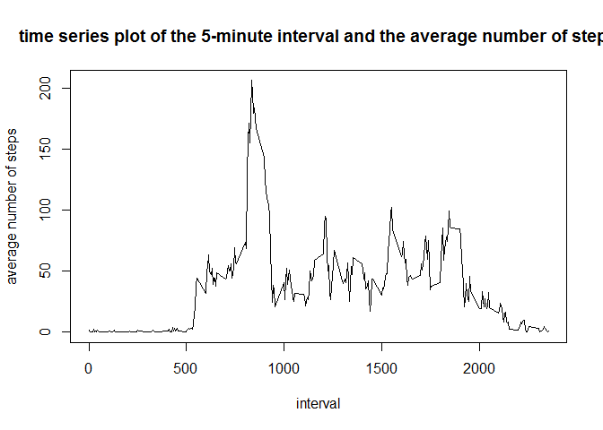
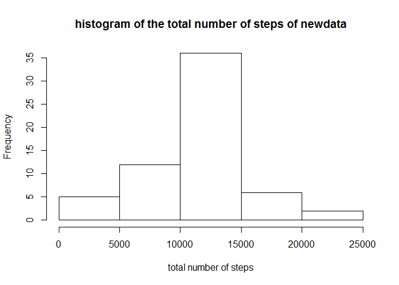

# Reproducible Research: Peer Assessment 1


## Loading and preprocessing the data

```r
options(scipen = 1)
data<-read.csv("D:/GIT/RepData_PeerAssessment1/activity.csv")
data$date <- as.Date(data$date)
```

## What is mean total number of steps taken per day?

```r
library(plyr)
data$date <- as.Date(data$date)
nsteps<-ddply(data,.(date),summarize,sum=sum(steps,na.rm=TRUE))
hist(nsteps$sum,xlab="total number of steps",main="histogram of the total number of steps")
```

 

```r
meansteps=round(mean(nsteps$sum,na.rm=TRUE),2)
mediansteps=median(nsteps$sum,na.rm=TRUE)
```

The mean of the total number of steps taken per day is 9354.23 and the median is 10395.

## What is the average daily activity pattern?

```r
msteps<-ddply(data,.(interval),summarize,mean=mean(steps,na.rm=TRUE))
plot(msteps$interval,msteps$mean,type="l",xlab="interval",ylab="average number of steps",main="time series plot of the 5-minute interval and the average number of steps")
```

 

```r
maxsteps=max(msteps$mean)
maxinterval=msteps$interval[[which(msteps$mean==maxsteps)]]
```

The 835 5-minute interval contains the maximum number of steps

## Imputing missing values

```r
nmiss=sum(is.na(data$steps))
ndata<-data
for (i in 1:length(ndata$steps)){
  if (is.na(ndata$steps[[i]])){
    ndata$steps[[i]]<-msteps$mean[[which(msteps$interval==ndata$interval[[i]])]]
  }
}
nnsteps<-ddply(ndata,.(date),summarize,sum=sum(steps,na.rm=TRUE))
hist(nnsteps$sum,xlab="total number of steps",main="histogram of the total number of steps of newdata")
```

 

```r
nmeansteps=round(mean(nnsteps$sum,na.rm=TRUE),2)
nmediansteps=round(median(nnsteps$sum,na.rm=TRUE),2)
```

The mean of the total number of steps taken per day of the newdata is 10766.19 and the median is 10766.19.

These values differ from the estimates from the first part of the assignment

Missing data in the data leads to the sum of the data equal to 0. Imputing missing data on the estimates of the total daily number of steps changes this situation.

## Are there differences in activity patterns between weekdays and weekends?

```r
library(lattice)
weekdays<-weekdays(ndata$date,abbreviate=TRUE)
week<-character(length = 0)
for (i in 1:length(weekdays)){
   if (weekdays[i]=="Sat" || weekdays[i]=="Sun"){
     week <- c(week,"weekend")
   }
   else {
     week <- c(week,"weekday")
   }
}
wdata<-cbind(ndata,as.factor(week))
wnsteps<-ddply(wdata,.(interval,week),summarize,mean=mean(steps,na.rm=TRUE))
xyplot(mean~interval | week,wnsteps,type="l",layout=c(1,2),ylab="Number of steps")
```

 
